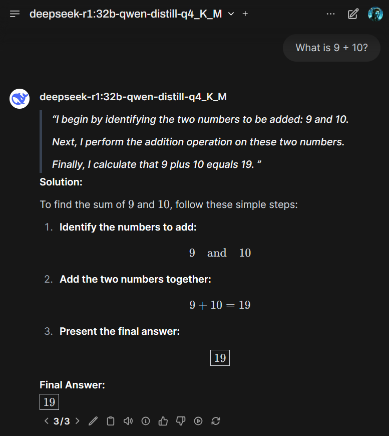

# open-webui-r1-formatter

*Attention*: This repository is deprecated because support for thinking LLMs has been officially added to Open WebUI.

This is a simple formatter for the DeepSeek R1 LLM and its distilled versions as well. It works through Open WebUI's Pipeline function.

The main purpose of this formatter is to transform `<think>...</think>` tags within the response content into a more readable format. This makes it easier for users to distinguish between different thinking outputs and the actual response content in the generated text. Addtionally, this code removes empty think blocks.

## Collapsible Mode

This modifies the response by placing \
 and \
 tags into the markdown to make each thought collapsible.

## Markdown Quote Mode

This is accomplished by placing right arrows `>` in front of each line of the thinking output. This is a common markdown format for quotations.

It is recommended to activate this function only for the R1 LLM, as other models may not use XML tags for thinking outputs.

Paste the contents of tools.py into your Open WebUI admin panel Functions.

